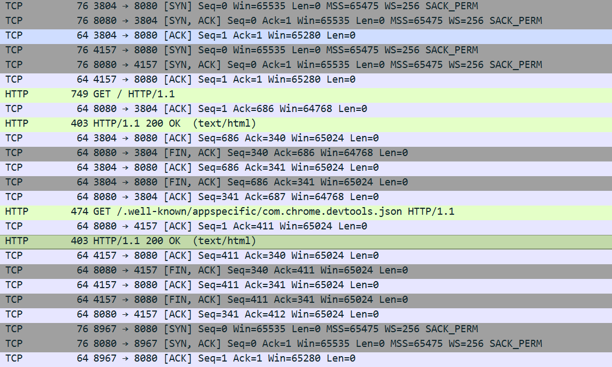

# 🏠 Go 홈서버 프로젝트

## 📋 프로젝트 개요
유튜브에서 우연히 보게된 한 동영상.
"웹개발자로서 네트워크의 전체적인 흐름을 파악하기 위한 학습 프로젝트를 로우언어로 만들어봐라. "
학부시절 해본적이 있던것 같지만 가물가물하기도 하고, 이번 기회에 네트워크 관련 복기를 해볼만한 프로젝트라 생각해서 시작해 봤다.

**핵심 목표**: HTML 문서를 읽어서 80포트로 소켓을 열고, HTTP GET 요청에 응답하는 기본 웹서버 구축

## 🎯 학습 목표
- **네트워크 흐름 이해**: 브라우저에서 서버까지의 데이터 전송 과정
- **HTTP 프로토콜 이해**: 요청/응답 구조와 상태 코드
- **TCP 소켓 통신**: 로우레벨에서의 네트워크 연결 관리
- **패킷 레벨 분석**: 와이어샤크를 통한 실제 네트워크 트래픽 관찰

## 🚀 현재 구현 상태(25.09.02)

### ✅ 완성된 기능
- **TCP 소켓 서버**: 8080 포트에서 클라이언트 연결 대기
- **HTTP 요청 파싱**: GET 요청 읽기 및 로깅
- **HTML 파일 서빙**: `static/index.html` 파일 읽어서 응답
- **HTTP 응답 생성**: 적절한 헤더와 함께 HTML 콘텐츠 전송
- **에러 처리**: 파일이 없을 경우 500 에러 페이지 표시

### 📁 프로젝트 구조
```
├── main.go              # 메인 서버 코드
└── static/
    └── index.html       # 서빙할 HTML 파일
```

## 🔧 실행 방법

### 1. 서버 실행
```bash
go run main.go
```

### 2. 브라우저 접속
```
http://localhost:8080
```

### 3. 와이어샤크로 패킷 관찰
1. 와이어샤크 실행 (관리자 권한)
2. 필터 설정: `tcp.port == 8080`  
3. 패킷 캡처 시작
4. 브라우저에서 접속하여 패킷 분석

## 📚 핵심 학습 내용

### HTTP 요청/응답 이해
**요청 예시:**
```
GET / HTTP/1.1
Host: localhost:8080
User-Agent: Mozilla/5.0...
```

**응답 예시:**
```
HTTP/1.1 200 OK
Content-Type: text/html; charset=utf-8
Content-Length: 123

<html>...</html>
```

### 상태 코드 이해
- **200 OK**: 성공적으로 요청 처리 (음식점에서 주문한 음식이 나온 상태)
- **404 Not Found**: 요청한 리소스가 없음 (메뉴에 없는 음식을 주문한 상태)
- **500 Internal Server Error**: 서버 내부 오류

### TCP 3-Way Handshake
1. **SYN**: 클라이언트 → 서버 "연결해줘"
2. **SYN-ACK**: 서버 → 클라이언트 "OK, 연결됐어"  
3. **ACK**: 클라이언트 → 서버 "고마워"

### 와이어샤크 패킷 분석


## 🔍 주요 발견사항

### 브라우저의 숨겨진 요청들
단순히 페이지 하나를 요청했다고 생각했지만, 실제로는 추가적인 요청들이 자동으로 발생:
(페이지에 접속한 상태에서 개발자 도구를 열면 자동으로 추가 요청을 함.)
```
GET /.well-known/appspecific/com.chrome.devtools.json HTTP/1.1
```

### 네트워크 복잡성 체감
- 단순한 HTML 페이지 하나를 보기 위해 여러 개의 패킷이 오가는 것을 확인
- 75ms 안에 일어나는 복잡한 네트워크 통신 과정 관찰

## 🛠 기술 스택
- **언어**: Go (네트워크 프로그래밍에 적합한 중간 수준 언어)
- **프로토콜**: HTTP/1.1, TCP
- **분석 도구**: Wireshark (패킷 캡처 및 분석)

## 🎯 다음 단계
- [ ] 포트를 8080에서 80으로 변경 (관리자 권한 필요)
- [ ] 정적 파일 서빙 기능 확장 (CSS, JS, 이미지)


## 💡 핵심 깨달음
> " 우연히 본 영상에서 시작된 이 프로젝트를 하면서 웹 프레임워크의 편리함을 다시 깨닫게 되었고, HTTP, 포트 등 네트워크에 관한 복기를 할 수 있었다. 동시에 파인만 학습법을 도입하여 AI와 함께 학습을 했는데, 내가 이해한 것을 다시 설명을하고(그래서 중간에 음식점 얘기가 나오는 것), 모르는 것을 다시 학습할 수 있어서 만족스러운 학습이었다."

---
*이 프로젝트를 통해 웹개발자로서 네트워크 스택의 저수준 동작을 이해하고, 일상적으로 사용하던 웹 기술들의 내부 구조를 체감할 수 있었습니다.*